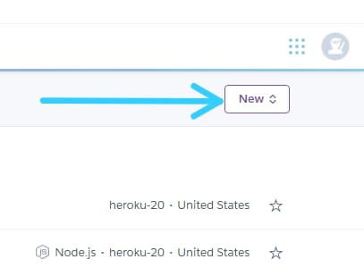
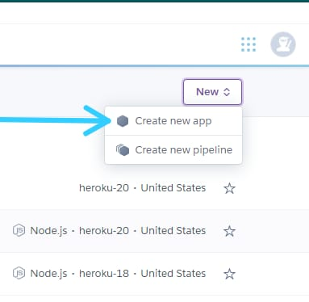
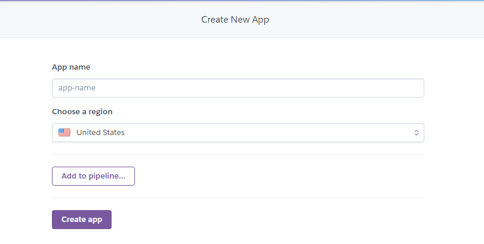
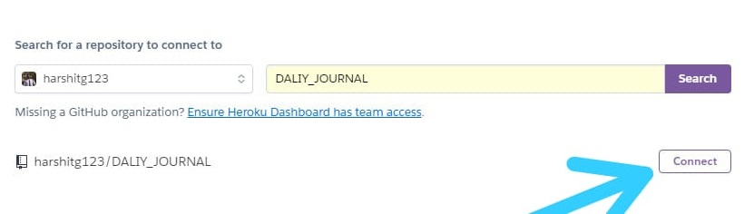
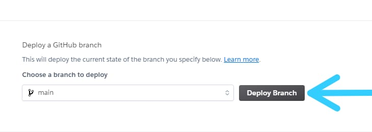

# Heroku
Heroku is a platform as a service (PaaS) that enables developers to build, run, and operate applications entirely in the cloud.

## Prepare Your Application.
<p> You have to make modification in two files for able to deploy your application on heroku. </p>
 
1. In your  `server.js`  file. Add below mentioned code where your port is defined, This will randomly generate the port available on heroku.

```
  let port = process.env.PORT
      
  if(port == null || port == ""){
    port = 3000;
  }
```   

2. In your  `package.json`  file add the following command in `scripts` object, Follow this step if you want to deploy from github, Otherwise skip this step.    

```
  "scripts": {
    "start": "node app.js"
  }
```

## Deploying from GitHub
<p> On your git bash run following command to push your project on github repo. </p>

```
  git remote add origin https://github.com/<username>/<repository name>.git
  
  git add .
  
  git commit -m <commit msg in quotes "" or ''>
  
  git push origin main
  
```
### Now follow the 6 simple steps. For deploying your website or web application.


Step 1: Loggin to heroku and click on `New ^`|  Step 2: Click on `Create new app`
:-------------------------------------------:|:-------------------------------------------:
                           |  

Step 3: Give your app name and click on `Create app`|  Step 4: Click on `GitHub`
:-------------------------------------------:|:-------------------------------------------:
                           |  

Step 5: Now click on `Connect`             | Step 6: Click on `Deploy`
:-----------------------------------------:|:-------------------------------------------:
                         | 


