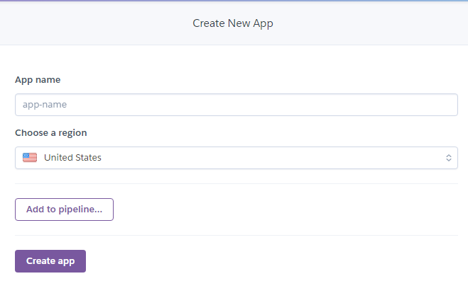
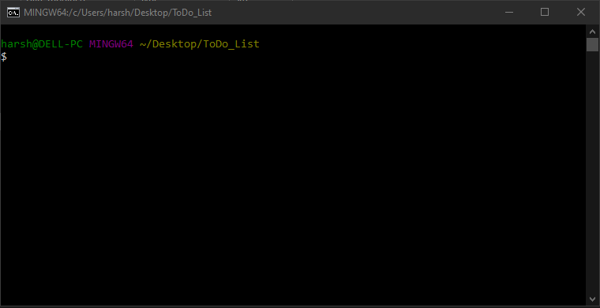
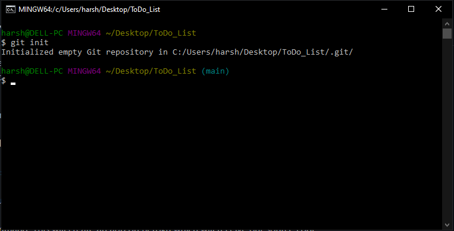
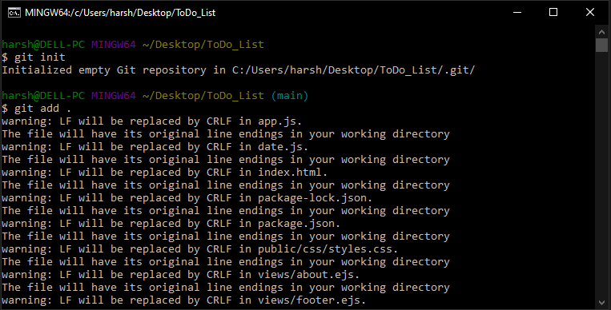
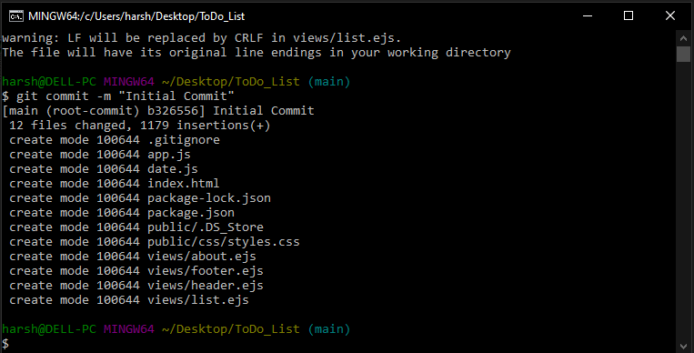
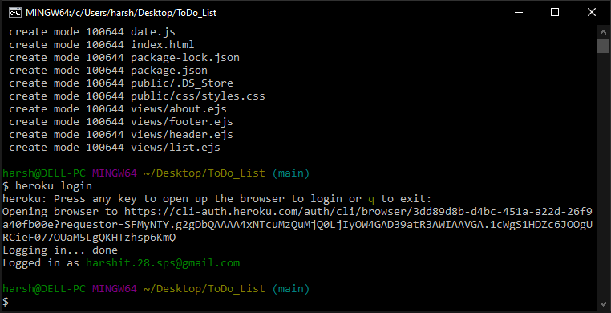
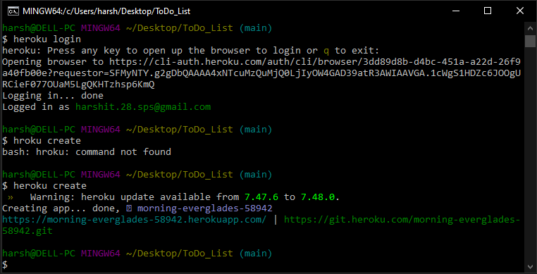
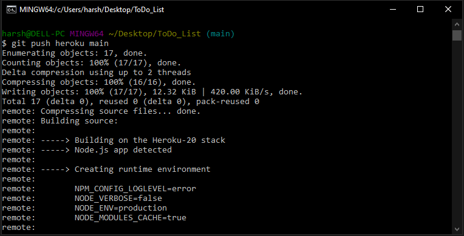

# Heroku  

Heroku is a platform as a service (PaaS) that enables developers to build, run, and operate applications entirely in the cloud.

## Prepare Your Application.
You have to make modification in two files or you can make one new file, `Procfile` and modify one file for able to deploy your application on heroku.
 
1. In your  `server.js`  file. Add below mentioned code where your port is defined, This will randomly generate the port available on heroku.

```
  let port = process.env.PORT
      
  if(port == null || port == ""){
    port = 3000;
  }
```   

2. In your  `package.json`  file add the following command in `scripts` object.    

```
  "scripts": {
    "start": "node app.js"
  }
```

<h3 align="center"> OR </h3> 


2. You need to make a file `Procfile` in your root directory follow strict naming convention otherwise it won't work. Do not give any extention to `Procfile`. Want to know more    about <a href="https://devcenter.heroku.com/articles/getting-started-with-nodejs#define-a-procfile">Procfile</a> follow this documentation. Add the following command in          Procfile from your text editor.

```
  web: npm app.js
```

Note: In 2 point `app.js` is my server file you can change the name of `app.js` to whatever name you given to your server file. 

# Deploying from GitHub
<p> On your git bash run following command to push your project on github repository. </p>

```
  git remote add origin https://github.com/<username>/<repository_name>.git
  
  git add .
  
  git commit -m <commit msg in quotes "" or ''>
  
  git push origin main
  
```
### Now follow these six simple steps.

Step 1: Loggin to heroku and click on `New ^`|  Step 2: Click on `Create new app`
:-------------------------------------------:|:-------------------------------------------:
                           |  

Step 3: Give your app name and click on `Create app`|  Step 4: Click on `GitHub`
:-------------------------------------------:|:-------------------------------------------:
                           |  

Step 5: Search the repo you want to deploy & click on `Connect` | Step 6: Scroll down & click on `Deploy Branch`
:-----------------------------------------:|:-------------------------------------------:
                         | 

If you have followed these six steps ☝️ to deploy, you would have successfully deployed your web application or website. After that heroku will give you the option to see your deployed app on the top & bottom.  

# Deploying from heroku CLI Command Line Interface.
The Heroku Command Line Interface (CLI) makes it easy to create and manage your Heroku apps directly from the terminal. It's an essential part of using Heroku.
Download and instal Heroku CLI from <a href="https://devcenter.heroku.com/articles/heroku-cli#:~:text=The%20Heroku%20Command%20Line%20Interface,essential%20part%20of%20using%20Heroku.">HEROKU CLI</a>. Now we need to install Git from <a href="https://git-scm.com/">GIT</a>. After Installing Heroku CLI & GIT follow below mentioned steps.
  
Step 1: Open `Git bash` on your project folder by right clicking on mouse. | Step 2: Initialize your project folder with empty git repository by typing command `git init`.
:-------------------------------------------------------------------------:|:----------------------------------------------------------------------------------------------:
                                                         | 

Step 3: Add files into staging area, Run this `git add .` command to add all file in staging area. | Step 4: Commit files using this `git commit -m <your_message>` command, Enter your message in double quotes.
:-------------------------------------------------------------------------:|:----------------------------------------------------------------------------------------------:
                                                         | 

Step 5: Enter `heroku login` command, This command will open browser for logging you in heroku. | Step 6: Run `heroku create` command, This will create an app on heroku which will receive our source code.
:----------------------------------------------------------------------------------------------:|:---------------------------------------------------------------------------:  
                                                                              | 

Step 7: Run `git push heroku main` command, This will push our source code on app into heroku.
:----------------------------------------------------------------------------------------------:
 

# Environment variables `.env` file
If you are having some type of secrets / environment variables in `.env` file then you might come up with unsuccessful deployment i.e whenever you open your app, your app may crash. So we have to set those secrets / environment variable on heroku, heroku will keep those as secret. Heroku has something called `Config Vars` which is same as enviroment variable so we need to provide the `KEY=VALUE` present in `.env` file.

- After deploying your app go to `setings`.
- scroll down a bit you will find `Config Vars` button.
- Click on it and add your `KEY=VALUE`.
- Now click on `Save`.

 

